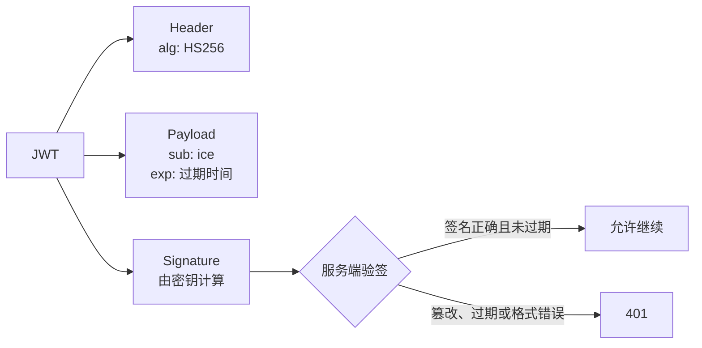
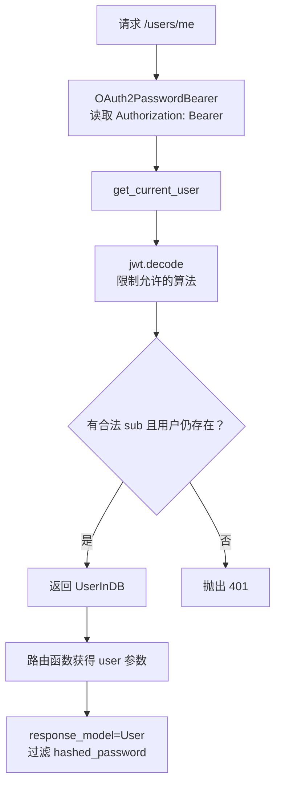

# FastAPI：从密码登录到 JWT 鉴权

这个示例把常见的登录闭环串了起来：校验用户名和密码、签发 JWT、从 `Authorization` 请求头取出令牌、验证令牌并得到当前用户。

`OAuth2PasswordBearer` 只负责从请求中读取 Bearer Token，并把安全方案写入 OpenAPI；真正的登录校验和 JWT 签发由 `/token` 完成。

```mermaid
sequenceDiagram
    autonumber
    participant C as 客户端
    participant A as FastAPI
    participant D as 用户库
    participant J as JWT

    C->>A: POST /token（用户名、密码）
    A->>D: 查询用户与密码哈希
    D-->>A: 用户记录
    A->>A: pwdlib.verify(明文, 哈希)
    A->>J: 使用 sub、exp 和密钥签名
    J-->>A: access_token
    A-->>C: { access_token, token_type: "bearer" }
    C->>A: GET /users/me<br/>Authorization: Bearer &lt;token&gt;
    A->>J: 校验签名、算法与过期时间
    J-->>A: sub（用户名）
    A->>D: 再次查询当前用户
    D-->>A: 用户记录
    A-->>C: 当前用户（不含密码）
```

## 先看四个角色

| 角色 | 在示例中的实现 | 负责什么 |
| --- | --- | --- |
| 密码哈希 | `PasswordHash.recommended()` | 保存哈希，登录时验证明文密码 |
| 登录端点 | `POST /token` | 接收表单、认证用户、返回访问令牌 |
| JWT | `jwt.encode()` / `jwt.decode()` | 在令牌中保存用户标识与过期时间，并用密钥签名 |
| 认证依赖 | `OAuth2PasswordBearer` + `get_current_user` | 取出 Bearer Token、校验令牌、注入当前用户 |

## 完整示例

<<< @/backend/fastapi/guide/17_oauth2/4finish_oauth.py

## 令牌里放了什么

示例只写入两个声明：`sub` 是用户的稳定标识，`exp` 是过期时间。JWT 是**已签名**而不是**加密**的，持有令牌的人可以读取载荷；不要把密码、手机号或其他敏感信息放进去。



## 代码如何完成一次登录

```python
password_hash = PasswordHash.recommended()
scheme = OAuth2PasswordBearer(tokenUrl="token")

def authenticate_user(username: str, password: str):
    user = fake_users_db.get(username)
    if not user or not password_hash.verify(password, user["hashed_password"]):
        return
    return UserInDB(**user)

def create_access_token(subject: str) -> str:
    expire = datetime.now(timezone.utc) + timedelta(minutes=30)
    return jwt.encode({"sub": subject, "exp": expire}, SECRET_KEY, algorithm="HS256")
```

`fake_users_db` 模拟数据库：它保存的是 `hashed_password`，不是明文密码。`authenticate_user()` 用 `verify()` 比较用户提交的密码与数据库哈希；匹配后再把用户名写入 `sub`。

```python
@app.post("/token")
async def login(form_data: Annotated[OAuth2PasswordRequestForm, Depends()]):
    user = authenticate_user(form_data.username, form_data.password)
    if not user:
        raise HTTPException(status_code=401, detail="用户名或密码错误")

    return Token(
        access_token=create_access_token(user.username),
        token_type="bearer",
    )
```

`OAuth2PasswordRequestForm` 约定登录数据来自 `application/x-www-form-urlencoded` 表单，而不是 JSON 请求体。`token_type="bearer"` 对应后续请求头里的 `Authorization: Bearer <access_token>`。

## 受保护接口如何拿到当前用户

```python
def get_current_user(token: Annotated[str, Depends(scheme)]):
    credentials_error = HTTPException(status_code=401, detail="无效的 token")

    try:
        payload = jwt.decode(token, SECRET_KEY, algorithms=[ALGORITHM])
        username = payload.get("sub")
        if not username or not isinstance(username, str):
            raise credentials_error
    except InvalidTokenError:
        raise credentials_error

    user = fake_users_db.get(username)
    if not user:
        raise credentials_error
    return UserInDB(**user)

@app.get("/users/me", response_model=User)
async def read_users_me(user: Annotated[UserInDB, Depends(get_current_user)]):
    return user
```

依赖按下面的顺序执行：



这里再次查询用户很重要：令牌即使格式正确，只要用户已被删除，也不能通过认证。`response_model=User` 只输出 `username`，避免把 `hashed_password` 返回给客户端。

## 本地验证

在 `docs/backend/fastapi` 目录运行：

```bash
uv run fastapi dev guide/17_oauth2/4finish_oauth.py
```

先请求登录接口：

```bash
curl -X POST http://127.0.0.1:8000/token \
  -H "Content-Type: application/x-www-form-urlencoded" \
  -d "username=ice&password=123456"
```

把响应中的 `access_token` 替换到下一条命令：

```bash
curl http://127.0.0.1:8000/users/me \
  -H "Authorization: Bearer <access_token>"
```

也可以打开 `http://127.0.0.1:8000/docs`，先在 `/token` 执行登录，再点右上角 **Authorize** 填入令牌后调用 `/users/me`。

## 从示例走向生产

- 把 `SECRET_KEY` 放到环境变量或密钥管理服务；每个环境使用不同的高强度随机值，不能使用示例中的常量。
- 用真实数据库替换 `fake_users_db`；注册时保存密码哈希，永远不保存或记录明文密码。
- 始终使用 HTTPS；Bearer Token 相当于短期通行证，被截获即可被使用。
- 访问令牌保持较短有效期。需要长期会话时，再设计刷新令牌、吊销策略和设备管理。
- 对不存在的用户也执行一次固定的密码哈希校验，可降低通过响应时间枚举用户名的风险。

## 参考

- [FastAPI：OAuth2 Password + JWT 官方教程](https://fastapi.tiangolo.com/tutorial/security/oauth2-jwt/)
- [FastAPI：安全机制入门](https://fastapi.tiangolo.com/tutorial/security/first-steps/)
- [PyJWT：编码与解码](https://pyjwt.readthedocs.io/en/stable/usage.html)
