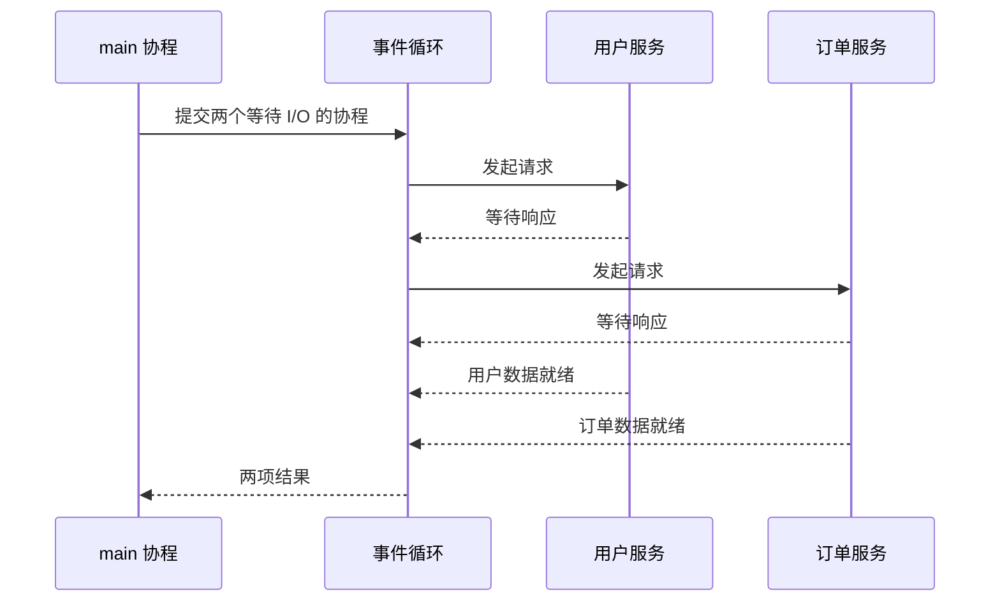
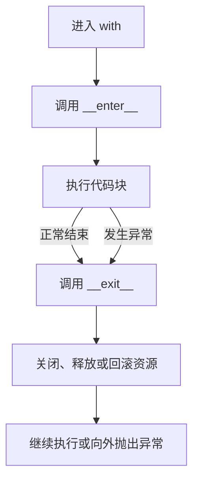

# 异步与上下文管理

迭代器通过 `for` 逐个取值，生成器通过 `yield` 暂停和继续。异步编程也会暂停，但暂停的原因不同：它在等待网络、数据库或文件等 I/O 操作时，把执行权交回事件循环，让别的任务先运行。

上下文管理则解决另一类问题：资源在什么时刻创建，又怎样保证它被释放。`with` 和 `async with` 会把“进入、使用、清理”固定为一段清晰的代码边界。

## 先认识四个角色

| 名称 | 作用 | 常见写法 |
| --- | --- | --- |
| 协程 | 可以在等待时暂停的函数 | `async def fetch(): ...` |
| 可等待对象 | 可以放在 `await` 后面的对象 | 协程、`Task`、部分库返回的对象 |
| 任务 | 被事件循环调度执行的协程 | `asyncio.create_task(...)` |
| 上下文管理器 | 成对处理资源的进入与退出 | `with ...`、`async with ...` |

`async def` 定义的是**协程函数**。调用它只会得到协程对象，并不会马上运行；在脚本入口使用 `asyncio.run(...)`，或在另一个协程里使用 `await`，才会驱动它执行。

## 异步在等待时切换任务

事件循环通常在一个线程中协调多个任务。遇到 `await` 时，当前协程声明“我得等一会儿”；如果等待的操作尚未完成，事件循环就可以去运行其他已经就绪的协程。



下面的 `asyncio.sleep()` 仅用于模拟 I/O 等待；两个请求会交错进行，所以总耗时约为 2 秒，而不是 3 秒。

<<< @/backend/python/async-context/code/1_concurrent.py

`asyncio.gather()` 会并发等待传入的可等待对象，并按传入顺序返回结果。需要单独保存、取消或观察某项工作时，可以用 `asyncio.create_task()` 创建任务：

```python
task = asyncio.create_task(fetch("用户服务", 1))
# 这里可以继续做别的事
user = await task
```

::: warning `async` 不会自动加速计算
`await` 是主动让出执行权的地方。纯 Python 的长时间计算没有机会让出事件循环，会阻塞其他协程；这类任务通常需要算法优化，或按场景使用线程、进程。异步最擅长的是大量等待 I/O 的工作。
:::

不要在协程中直接调用 `time.sleep()`、同步 HTTP 客户端或其他长时间阻塞函数；它们会卡住整个事件循环。优先使用库提供的异步 API，例如 `await asyncio.sleep()` 或异步数据库/HTTP 客户端。

## `async for`：异步版的逐个取值

已有的生成器用 `yield` 逐个产出值；异步生成器把它写在 `async def` 中，并可以在两次产出之间 `await` I/O。消费它时改用 `async for`：

```python
import asyncio


async def receive_messages():
    for message in ["连接成功", "收到数据", "连接关闭"]:
        await asyncio.sleep(1)  # 模拟下一条消息到达
        yield message


async def main():
    async for message in receive_messages():
        print(message)


asyncio.run(main())
```

普通生成器用 `for`，异步生成器用 `async for`。它们都按需产出值；区别在于异步生成器可以等待下一项的到来。

## `with` 如何保证清理

读文件时常写 `with open(...) as file`。无论代码块正常结束还是抛出异常，退出时都会执行清理逻辑。这个约定由两个方法组成：进入时调用 `__enter__()`，离开时调用 `__exit__()`。



这个极简事务类展示了异常路径。`__exit__()` 收到异常信息后执行回滚；它返回 `False`，因此异常不会被悄悄忽略。

<<< @/backend/python/async-context/code/2_transaction.py

常见的文件、锁、数据库连接都适合用上下文管理器。一般只在确实想处理并忽略异常时才让 `__exit__()` 返回真值；默认让异常继续传播更安全。

## `async with`：需要等待的资源清理

异步资源的连接和关闭本身可能需要网络 I/O，因此不能放进普通的 `with`。`async with` 对应 `__aenter__()` 和 `__aexit__()`，这两个方法都会返回可等待对象。

`contextlib.asynccontextmanager` 是最直观的写法：`yield` 前准备资源，`yield` 后放清理逻辑；`try`/`finally` 让清理在异常或取消时也能运行。

<<< @/backend/python/async-context/code/3_async_context.py

这里的 `yield` 与生成器章节中的暂停点有关，但装饰器把这个异步生成器包装成了一个异步上下文管理器。它只应产出一次：产出给 `as` 使用的资源，然后在退出时执行清理。

## FastAPI：用 `lifespan` 管理整个应用的资源

单个请求可以使用 `async with` 获取短生命周期的资源；连接池、共享 HTTP 客户端、机器学习模型这类“应用启动时创建、停止时释放”的资源，则适合交给 FastAPI 的 `lifespan`。


下面使用一个简化的邮件客户端演示。真实项目中可把它替换为数据库连接池或异步 HTTP 客户端；路由通过 `request.app.state` 取得已经准备好的共享对象。

<<< @/backend/python/async-context/code/4_fastapi_lifespan.py

把 `lifespan` 传给 `FastAPI(...)` 后：

1. `yield` 前的代码在应用开始接收请求前执行一次。
2. `yield` 期间，应用处理任意数量的请求。
3. `yield` 后的代码在应用关闭时执行一次。

FastAPI 当前推荐使用 `lifespan`；一旦传入它，`startup` 和 `shutdown` 事件处理器不会再执行，因此不要在同一个应用中混用两种方式。

## 选择清单

| 需求 | 选择 |
| --- | --- |
| 并发等待多项网络、数据库或文件 I/O | `async def` + `await`，需要汇合结果时用 `asyncio.gather()` |
| 流式接收消息或逐步读取异步数据 | 异步生成器 + `async for` |
| 确保文件、锁、事务等同步资源被释放 | `with` |
| 确保异步连接、会话等资源被关闭 | `async with` + `@asynccontextmanager` |
| 为整个 FastAPI 应用创建和销毁共享资源 | `lifespan` |

## 参考资料

- [Python 文档：协程与任务](https://docs.python.org/3/library/asyncio-task.html)
- [Python 文档：上下文管理器](https://docs.python.org/3/reference/datamodel.html#context-managers)
- [Python 文档：`asynccontextmanager`](https://docs.python.org/3/library/contextlib.html#contextlib.asynccontextmanager)
- [FastAPI 文档：Lifespan Events](https://fastapi.tiangolo.com/advanced/events/)
