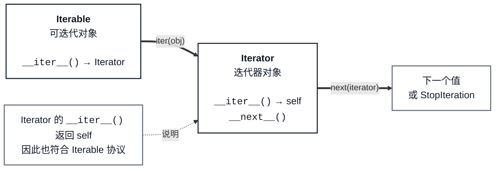

# 迭代器与生成器

## 1. 为什么需要迭代

### 1.1 一次性准备数据的问题

列表会先把所有元素放进内存。数据量很大时，创建列表本身就可能很昂贵：

<<< @/backend/python/iterator-generator/code/1遍历一个超大的数组.py

迭代的做法不同：**需要一个元素，再取一个元素**。迭代器因此特别适合大文件、网络数据和按需计算的结果。

## 2. 先认识两个协议

### 2.1 可迭代对象：提供迭代器

可迭代对象（`Iterable`）实现 `__iter__()`。调用 `iter(obj)` 时，Python 会调用这个方法，取得一个迭代器。

常见的可迭代对象有 `list`、`tuple`、`str`、`dict`，以及后面要实现的 `Sentence`。

### 2.2 迭代器对象：产出下一个值

迭代器（`Iterator`）需要同时实现两个方法：

- `__iter__()`：返回自己，因此迭代器也属于可迭代对象。
- `__next__()`：返回下一个元素；没有元素时抛出 `StopIteration`。

### 2.3 两者的关系



可以把它记成两句话：

1. 可迭代对象通过 `__iter__()` **构建或返回**迭代器。
2. 迭代器通过 `__next__()` **逐个产出**元素，并让 `__iter__()` 返回 `self`。

## 3. 自己实现：容器与游标分开

### 3.1 职责划分

`Sentence` 只保存单词；`SentenceIterator` 才保存 `index`（游标）。每次调用 `iter(sentence)`，都创建一个新的 `SentenceIterator`。

这样，两个循环不会共享游标；同一个 `Sentence` 也可以从头遍历多次。

### 3.2 完整实现

<<< @/backend/python/iterator-generator/code/2编写一个迭代器.py

### 3.3 为什么迭代器返回 `self`

`SentenceIterator` 自己已经有 `index`，也实现了 `__next__()`，所以它的 `__iter__()` 返回 `self`。

`Sentence` 不应返回 `self`：它是数据容器，不应保存一次遍历的游标。否则第一次循环会消耗它，第二次循环为空，嵌套循环也会相互影响。

## 4. `for...in` 如何工作

### 4.1 等价过程

`for word in sentence` 会先调用 `iter(sentence)`，然后反复调用 `next(iterator)`：

```python
iterator = iter(sentence)

while True:
    try:
        word = next(iterator)
        print(word)
    except StopIteration:
        break
```

### 4.2 可迭代对象可以重来，迭代器会被消耗

列表每次调用 `iter()` 都会得到新的迭代器，因此可以反复循环；已经取出的 `it1` 则只会从当前游标继续，耗尽后不会自动重置。

<<< @/backend/python/iterator-generator/code/fluent/0demo.py
