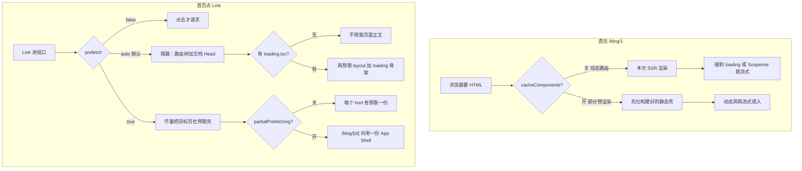
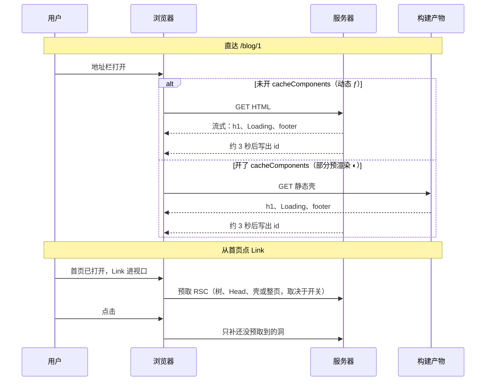

# 流式渲染、预渲染与预取

`<Suspense>`、`loading.tsx`、`<Link>`、`cacheComponents`、`partialPrefetching` 经常一起出现，但它们不在同一条路上。前两个管**这一次 HTML / RSC 怎么流出来**；后三个管**壳有没有在构建时算好**，以及**点链接之前浏览器预取什么**。

本文以 Next.js 16.3 的 App Router 为准，用一条动态博客路由 `/blog/[id]` 把交叉点串起来。更基础的静态 / 动态划分见 [渲染策略](/frontend/next/rendering-strategy)，目录约定见 [App Router](/frontend/next/app-router)。

## 先记住这几点

- 先分两条路：**直达 URL**（刷新、地址栏）只走 Suspense / `loading.tsx` / `cacheComponents`；**从别的页点 `<Link>`** 才会用到 `prefetch` 和 `partialPrefetching`。
- `loading.tsx` 是路由级 `<Suspense>`，包住整个 `page`，不包同级 `layout`。页面里再写 `<Suspense>` 是更细的洞。
- 降低 TTFB 的是「服务端碰到边界就能先吐第一段」。`cacheComponents` 把这段壳提前写进构建产物；Link 预取不降低首页文档的 TTFB，只让下一次导航更快。
- `partialPrefetching` 必须配 `cacheComponents`。它不改变 `◐` 预渲染，只改多条 `/blog/1`、`/blog/2` 是各自预取，还是共用一份壳。
- 构建符号：`ƒ` 是每次现渲染（仍可流式）；`◐` 是壳已预渲染，洞在请求时填。

## 五个角色

| 名称 | 作用时机 | 解决什么 | 不解决什么 |
| --- | --- | --- | --- |
| `<Suspense>` | 渲染这一次组件树 | 慢的子树先出 fallback，其余继续 | 不缓存、不预渲染、不预取 |
| `loading.tsx` | 同上，文件约定 | 整页还没出来时的路由级骨架 | 不等于页面里任意 Suspense |
| `<Link>` | 客户端导航前 | 链接进视口就预取，点击少等 | 不管首次打开这个 URL |
| `cacheComponents` | 构建 + 直达 | 预渲染壳（`◐`），可用 `"use cache"` | 单独不改变 Link 的旧预取模型 |
| `partialPrefetching` | 仅 Link 预取 | 同一路由共用 App Shell | 不改首次 HTML；不能单独开 |

## 两条轴

直达和点链接不是同一套请求。首页 Network 里出现的 `/blog/1?_rsc=...` 是预取；地址栏打开 `/blog/1` 才是文档流。



## 示例页面

下面这条路由会 `await params`，再故意等 3 秒，所以它是动态的。`Blog` 本身不 `await`，立刻返回带内层边界的 JSX。

<<< ./code/streaming-prefetch/blog-page.tsx

首页用两个链接指向同一动态段。不写 `prefetch` 时默认是 `"auto"`；写成 `prefetch` 等价于 `prefetch={true}`。

<<< ./code/streaming-prefetch/home-links.tsx

`loading.tsx` 若放在 `app/blog/loading.tsx` 或 `app/blog/[id]/loading.tsx`，会包住对应 segment 的 `page`：

<<< ./code/streaming-prefetch/loading.tsx

打开 Cache Components 和 Partial Prefetching 时，配置如下。后者依赖前者，单独开机会在 `next build` / `next dev` 校验失败。

<<< ./code/streaming-prefetch/next.config.ts

## 交叉点：用 /blog/[id] 走一遍

### 1. 只有内层 Suspense

**直达 `/blog/1`：** `Blog` 立刻返回。服务端碰到内层边界，先输出 `h1`、`Loading...`、`footer`，大约 3 秒后再换成 `id: 1`。

TTFB 是「渲染到第一个 fallback」的时间，不是 3 秒。没有这条边界时，3 秒内不会有第一字节。

**首页 Blog2（`auto`）：** 仍会发预取，但只是路由树和文档 Head（title / favicon），没有 `h1`、fallback、`id`。点击后再拉正文，再流式。

**首页 Blog1（`prefetch={true}`）：** 尽量预取整页，连那 3 秒动态内容也算进预取。预取请求本身会等 `BlogContent`。点击时可能已经有 `id: 1`，也可能还在飞行中。

页面里的 `<Suspense>` 不会让 `auto` 去预取页面骨架。官方约定是停在最近的 **`loading.js` 文件**，不是任意 Suspense。

### 2. 再加上 loading.tsx

约定上的组件树是：

```text
layout.tsx
  └── loading.tsx      ← 路由级 Suspense，包住整个 page
        └── page.tsx   ← h1、内层 Suspense、footer
              └── BlogContent（约 3 秒）
```

**直达：** 若 `page.tsx` 顶层不 suspend（上面的 `Blog` 就是这样），外层 `loading.tsx` 往往不会出现，仍是内层 `Loading...`。只有 page 自己在顶层 `await`、又没有内层边界时，才会先整页换成 `loading.tsx`。

**`auto` 预取：** 有 `loading.tsx` 之后，动态路由会多预取「到 loading 边界为止」的壳，也就是 layout + `loading.tsx`。点进去先出这段骨架；`h1` / `footer` 仍要等 page 开始流。

`loading.tsx` 既降低直达 TTFB（page 会挂起时），又给 `auto` 一个可预取的即时 UI。两个都在时：直达看谁先接住 suspend；预取 `auto` 只认 `loading.tsx` 这一层文件边界。

### 3. 打开 cacheComponents

构建从 `ƒ` 变成 `◐`。边界外面能进静态壳，边界里面请求时填。

| 怎么包 | 构建时进壳 | 请求时才跑 |
| --- | --- | --- |
| 只有内层 Suspense | `h1`、`Loading...`、`footer` | `BlogContent`（params + 3 秒） |
| 只有 `loading.tsx` | layout + loading 骨架 | 整个 page（含 h1 / footer） |
| 两个都有 | 外层 loading 进壳；若 page 立刻返回，内层 fallback 也可进壳 | 仍是 `BlogContent` |
| 两个都没有 | 构建失败：`params` / 未缓存数据在边界外 | — |

**直达 TTFB：** 第一段 HTML 来自构建产物，不必等这次 Node 把 page 跑到第一个 fallback，比「每次 SSR 再流式」更短。3 秒延迟还在，只是发生在壳已经送到之后。

**Link：** 还是旧模型。`auto` 仍按「静态整页 / 动态到 loading.js」；`prefetch={true}` 仍按链接各拉一份。`◐` 不会自动让 `/blog/1` 和 `/blog/2` 共用预取。

### 4. 再开 partialPrefetching

只影响 Link，而且必须已经 `cacheComponents: true`。

| Link | 只开 cacheComponents | 再加上 partialPrefetching |
| --- | --- | --- |
| `<Link href="/blog/2">`（auto） | 旧 auto：探路或到 loading | 预取 `/blog/[id]` 共用的 App Shell（有 h1、内层 fallback、footer，没有具体 id） |
| `<Link prefetch>`（true） | 连动态内容也按这个 href 预取 | 壳 + 尽量解析这条 URL 的 `params`；未缓存的 3 秒内容仍会在 Suspense 停下 |
| 直达 `/blog/1` | 仍是 `◐` | 不变 |

首页两个链接：不开时可能是每个 href 一套预取；开了之后静态壳只拉一次，`id: 1` / `id: 2` 默认点击后再填。

## 直达和点 Link 的时序



`auto` 对动态路由、又没有 `loading.tsx` 时，预取那两步通常是：

1. **Route Tree**（`Next-Router-Segment-Prefetch: /_tree`）：告诉客户端路由怎么切分，页面 RSC 为空。
2. **Head**：charset、viewport、`<title>`、favicon，用来立刻改文档头。

这两步都不是页面正文。Network 里出现 `/blog/1?_rsc=...`，不等于已经预取了 Suspense 里的内容。

## TTFB 到底谁在减

「减少 TTFB」只对**这一次文档 / RSC 开始有字节**成立：

- **无边界的 SSR：** 等满 3 秒才有第一字节。TTFB 约等于 3 秒。
- **有 Suspense / `loading.tsx`：** 碰到边界就 flush。TTFB 约等于服务端起渲染并到达 fallback。用户仍要再等 3 秒看到 id。
- **`cacheComponents`：** 壳不用这次算。TTFB 还可以再短。
- **Link 预取：** 首页自己的 TTFB 不变。变的是下一次导航等不等、等的是壳还是整页。

预取成功也不等于页面已经渲染完。树和 Head 先回来时，`h1` 和 `id` 都还没有。

## 配置对照

对 `/blog/[id]` 加首页两个 Link：

| cacheComponents | partialPrefetching | loading.tsx | 内层 Suspense | 构建 | 直达先看到 | auto 预取到 | prefetch true |
| --- | --- | --- | --- | --- | --- | --- | --- |
| 关 | 关（也不能开） | 无 | 有 | 动态 | h1 + Loading + footer | 树 + Head | 连 3 秒内容也预取 |
| 关 | — | 有 | 无 | 动态 | loading 骨架 | layout + loading | 整页含数据 |
| 关 | — | 有 | 有 | 动态 | 谁接住 suspend 谁先出 | 停在 loading 文件 | 整页 |
| 开 | 关 | 无 | 有 | 部分预渲染 | 预渲染的 h1 + Loading + footer | 旧 auto | 按链接尽量全量 |
| 开 | 开 | 无 | 有 | 部分预渲染 | 同上 | 共用 App Shell | 壳 + URL 相关（未缓存的仍会停） |
| 开 | 任意 | 无 | 无 | 构建失败 | — | — | — |

## 容易踩坑

- 肉眼都是「先 Loading 再出 id」，看不出动态渲染和部分预渲染。差在壳是这次 SSR 算的，还是构建时就算好的。
- Network 里有 `/blog/1?_rsc=` 不等于预取了 Suspense 内容。先看 body 里有没有 `h1` / `id:`，以及请求头是 `/_tree` 还是真正的 page。
- `<Link prefetch>` 就是 `prefetch={true}`，和默认 `auto` 不是一回事。对 3 秒动态页，`true` 会把等待提前到「链接出现在首页时」。
- `partialPrefetching` 不会让构建从动态变成部分预渲染，也不能单独生效。
- 预取默认发生在 production（`next start`）。`next dev` 里不要用 Network 判断预取是否生效。

## 怎么选

- 只要直达时别整页白屏：给慢的数据加 `<Suspense>`；整页都在等再加 `loading.tsx`。
- 希望壳不占用这次请求的计算：开 `cacheComponents`，把运行时数据放进边界（或 `"use cache"`）。
- 列表页有大量指向同一动态段的链接：再开 `partialPrefetching`，让它们共用 App Shell。
- 某个链接点击前就要带上该 URL 的缓存内容：给它 `prefetch={true}`。实时、未缓存的数据仍然会在边界停下。

## 参考

- [Streaming](https://nextjs.org/docs/app/guides/streaming)
- [loading.js](https://nextjs.org/docs/app/api-reference/file-conventions/loading)
- [Link prefetch](https://nextjs.org/docs/app/api-reference/components/link#prefetch)
- [cacheComponents](https://nextjs.org/docs/app/api-reference/config/next-config-js/cacheComponents)
- [partialPrefetching](https://nextjs.org/docs/app/api-reference/config/next-config-js/partialPrefetching)
- [Building：构建符号](https://nextjs.org/docs/app/guides/building)
- [Prefetching](https://nextjs.org/docs/app/guides/prefetching)
- [Caching / Partial Prerendering](https://nextjs.org/docs/app/getting-started/caching)
